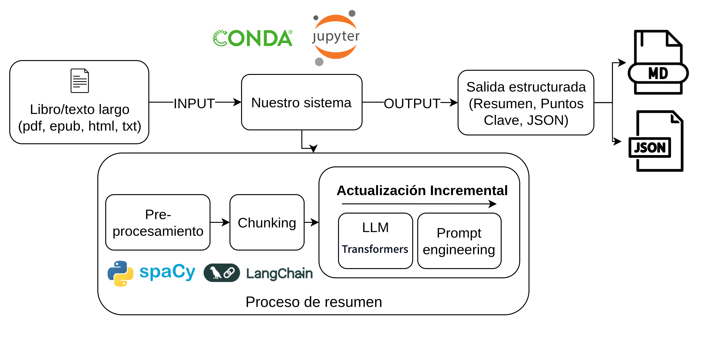

# 📘 Book Summarizer
## Descripción

**Book Summarizer** es una aplicación en Python basada en *Streamlit* que permite generar resúmenes automáticos de textos largos (como capítulos de libros, artículos o ensayos).
El proyecto utiliza una arquitectura modular de “proveedores de resumen”, lo que permite conectar distintos modelos según las necesidades del usuario o la disponibilidad de recursos.

## Características principales



* Interfaz simple construida con **Streamlit**.
* Soporte para **múltiples proveedores de modelos**:

  * OpenAI (GPT-3.5, GPT-4)
  * Hugging Face (T5, DistilBART)
  * OpenRouter (modelos gratuitos o alternativos)
* Compatible con **CUDA** para aceleración por GPU.
* Modular y fácilmente extensible: se pueden añadir nuevos proveedores implementando una clase que herede de `SummarizationProvider`.

## Estructura del proyecto

```
book_summarizer/
│
├── app.py                     # Punto de entrada principal (interfaz Streamlit)
├── file_processor.py          # Procesamiento de archivos PDF o texto
├── providers/
│   ├── base.py                # Clase base 'SummarizationProvider'
│   ├── openai_provider.py     # Integración con OpenAI
│   ├── huggingface_provider.py# Integración con modelos de Hugging Face
│   └── openrouter_provider.py # Integración con OpenRouter
│
├── requirements.txt           # Dependencias del proyecto
├── README.md                  # Documentación general
└── CHANGELOG.md               # Registro de cambios del proyecto
```

---

## Instalación

```bash
git clone https://github.com/tuusuario/book_summarizer.git
cd book_summarizer
python -m venv venv
source venv/bin/activate  # (o .\venv\Scripts\activate en Windows)
pip install -r requirements.txt
```

## Uso

1. Ejecuta la aplicación:

   ```bash
   streamlit run app.py
   ```
2. Sube un archivo PDF o ingresa texto manualmente.
3. Selecciona el proveedor (OpenAI, Hugging Face o OpenRouter).
4. Ajusta la longitud del resumen y ejecuta.

---

## Configuración de API Keys

Para cada proveedor, define tu clave en variables de entorno o en un archivo `.env`:

```bash
export OPENAI_API_KEY="tu_clave"
export OPENROUTER_API_KEY="tu_clave"
```

---

## Agregar nuevos proveedores

Para crear un nuevo proveedor:

1. Crea un archivo en `providers/`.
2. Hereda de `SummarizationProvider`.
3. Implementa el método `summarize(self, text, max_length, min_length)`.

Ejemplo mínimo:

```python
from providers.base import SummarizationProvider

class CustomProvider(SummarizationProvider):
    def summarize(self, text, max_length, min_length):
        return "Resumen generado por CustomProvider"
```

---